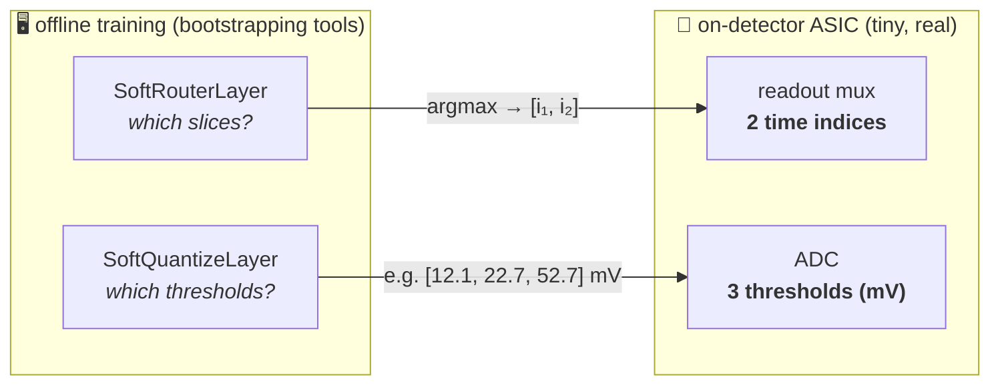
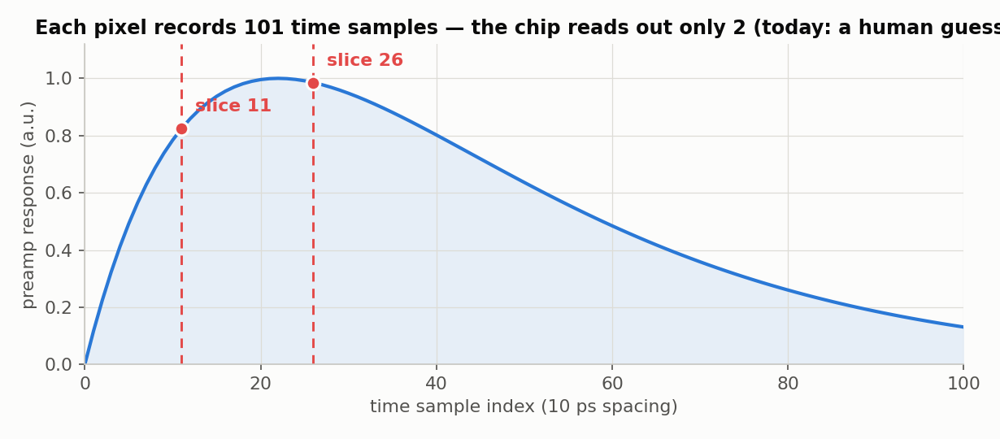
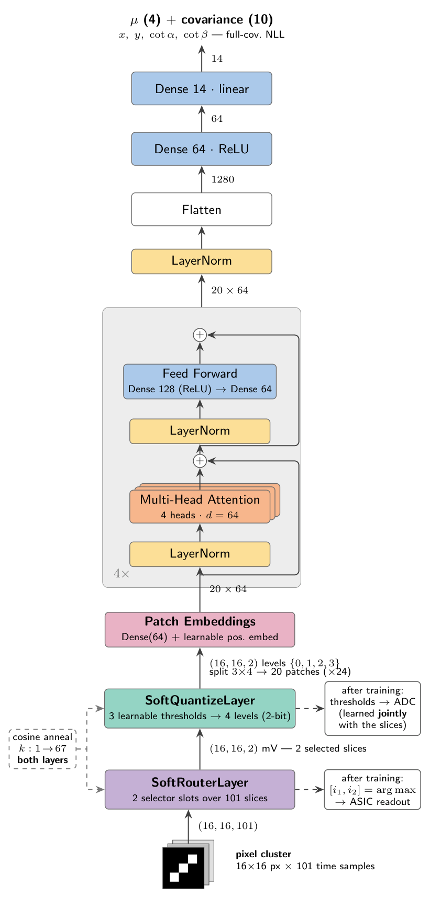
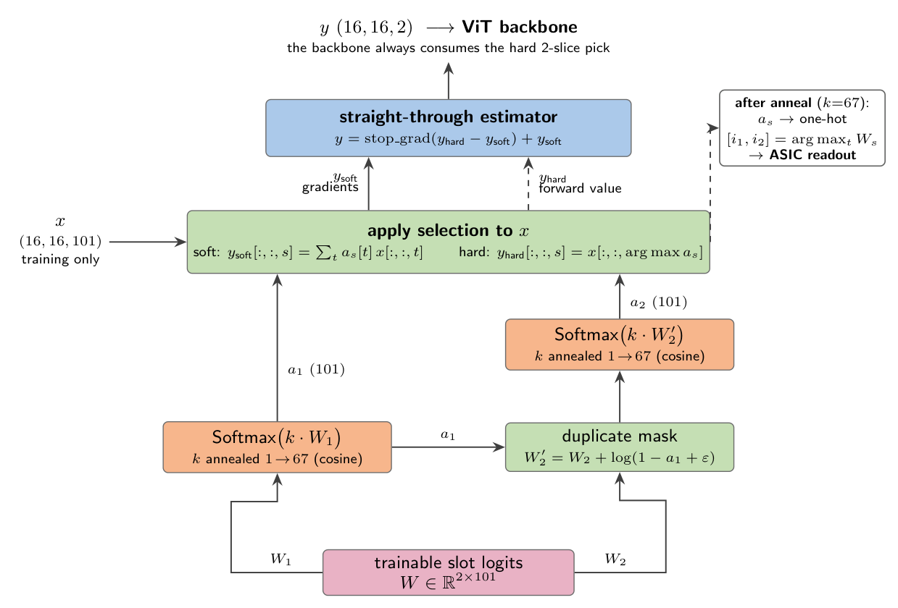
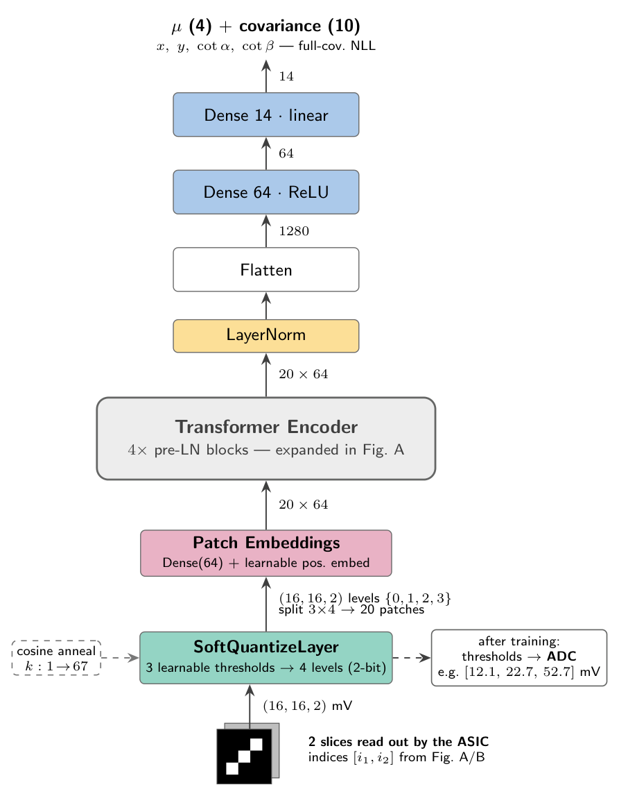
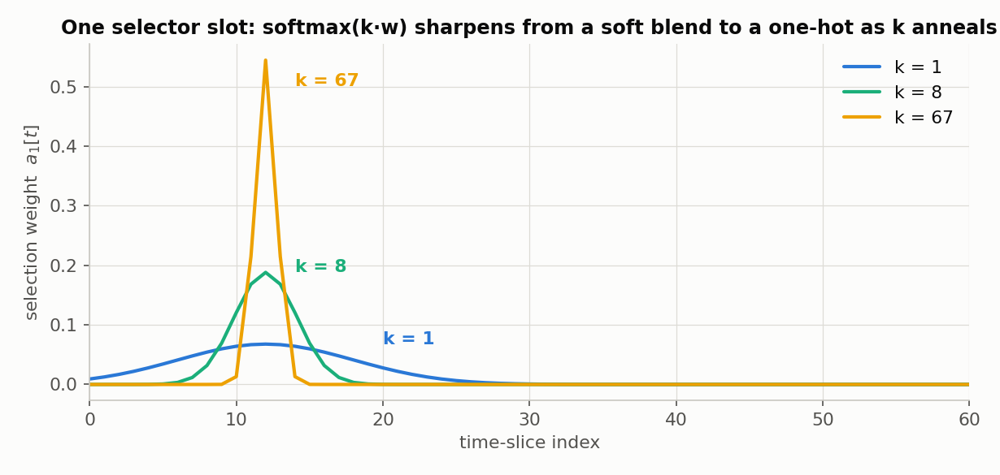
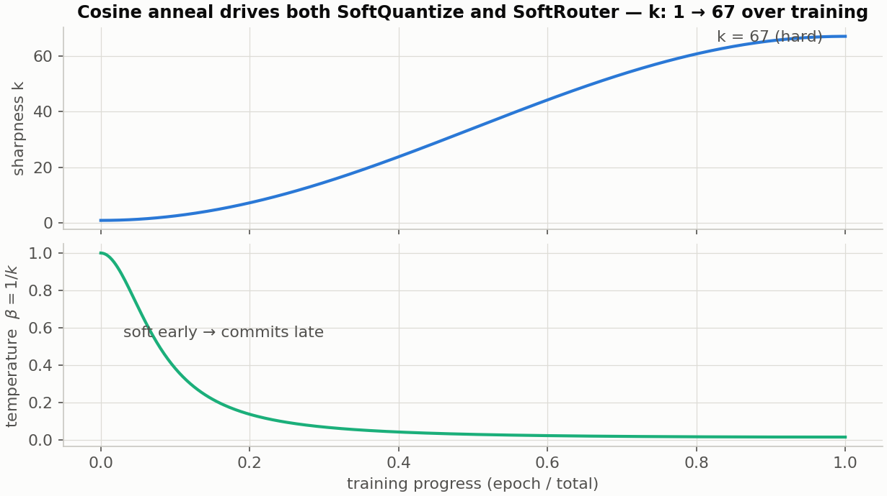
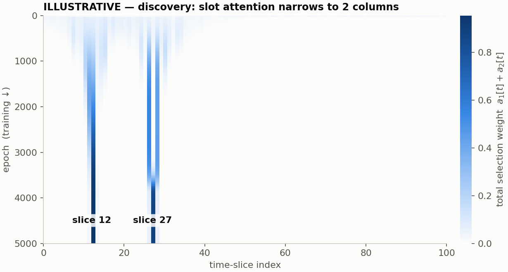
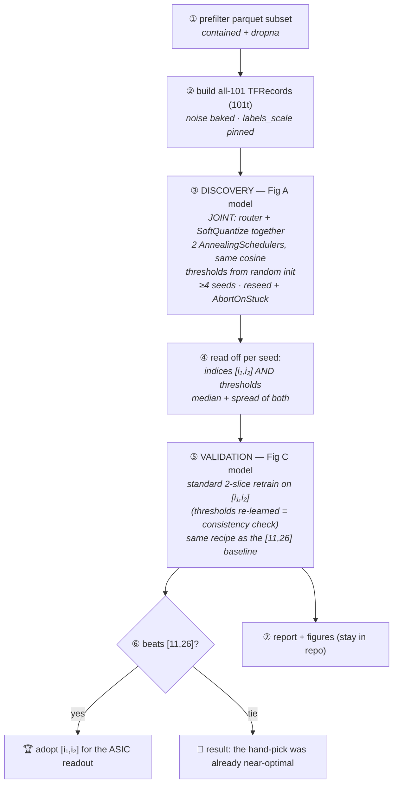
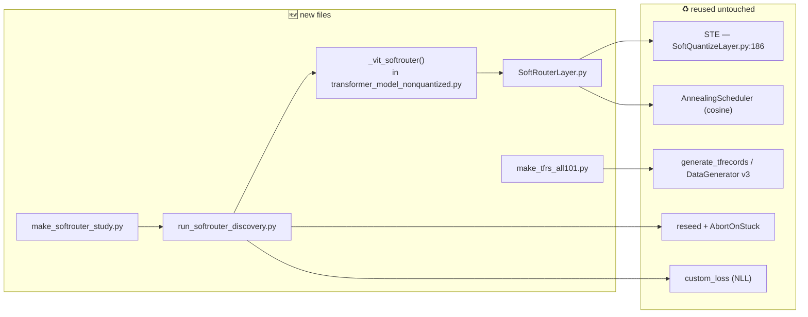

# 🎛️ SoftRouterLayer — learning *which 2 time slices* the chip should read

> `SoftQuantizeLayer` learns the **ADC thresholds**. `SoftRouterLayer` learns the **2 readout
> time indices** (today hand-picked as `[11,26]`). Same annealing trick, different axis —
> and **no extra loss term**: with exactly 2 selector slots, "pick 2" is built into the
> architecture, the training just decides *which* 2.

**v3 — written fresh; all figures below are new (TikZ + validated-palette plots).**
Scope: offline discovery tool (never on-chip) · k = 2 structural · **slices + thresholds
optimized JOINTLY in one model** (thresholds from random init, not the prior optimum) ·
data generator frozen.

---

## 1. The idea in one picture

Everything we train is an **oversized offline optimizer** — none of it ships. Only the
*learned numbers* cross to the ASIC:



And the problem itself — each pixel records a 101-sample waveform, but the chip can only
keep **2** samples. Which 2? Today: a guess. After this project: learned.



---

## 2. The models — three architecture figures

### Fig A — the discovery model (what we train)

All 101 slices go in; the **SoftRouterLayer** squeezes them to 2, then **SoftQuantizeLayer**
digitizes those 2 — and **both are optimized jointly**, driven by the same cosine anneal,
with thresholds starting from the usual random window (NOT the previously-found optimum).
Why joint: **thresholds are slice-dependent** — different slices have different amplitude
distributions, so thresholds pre-tuned for `[11,26]` would bias the router toward slices
with similar amplitudes. Joint training finds a *consistent* pair (slices + thresholds that
fit them). Every backbone block and dimension is verified against
`transformer_model_nonquantized.py` — note the **pre-LN** block order (LayerNorm *before*
attention/FF; residual adds after), which differs from the textbook Vaswani figure.



### Fig B — inside the SoftRouterLayer (the new layer)



#### The layer, from the ground up

**In one sentence:** a layer whose entire job is to hold **two learnable "score sheets" over
the 101 time slices** and turn them — gradually, over training — into two committed picks.

**The parameters (all 203 of them):**
- **`W` — a 2×101 matrix.** Row 1 is slot 1's score for every slice, row 2 is slot 2's.
  That's the whole "brain" of the layer: 202 numbers.
- **`log_k` — the sharpness**, the same knob SoftQuantize has, driven by the same
  `AnnealingScheduler` (cosine 1→67).

No dense layers, no per-event score computation — the scores are **global weights**, because
the answer must be one fixed pair of indices for the chip, not a per-cluster choice.

**How one slot picks — softmax as a "spotlight."** Slot 1 computes `a₁ = softmax(k·W₁)`:
101 numbers summing to 1, a spotlight over the time axis whose **focus is set by k**.
Tiny example with 5 slices, scores `W₁ = [0.2, 1.5, 0.3, −0.1, 0.9]`:

| | slice 0 | slice 1 | slice 2 | slice 3 | slice 4 |
|---|---|---|---|---|---|
| `a₁` at **k=1** (early) | 0.12 | **0.43** | 0.13 | 0.09 | 0.24 |
| `a₁` at **k=10** (late) | ~0 | **0.998** | ~0 | ~0 | 0.002 |

Same scores, different k: early = wide blend (every slice participates a little), late = a
laser (**one-hot**). Identical in spirit to SoftQuantize's sigmoids steepening into step
functions (see §3).

**The duplicate mask — why the slots can't agree on the same slice.** Before slot 2's
softmax, its scores are corrected: `W₂' = W₂ + log(1 − a₁ + ε)` — *wherever slot 1's
spotlight shines, slot 2's scores are crushed.* In the example at k=10, `a₁[1] ≈ 0.998`, so
`log(1−0.998) ≈ −6.2`: slice 1 becomes hopeless for slot 2, which must commit elsewhere.
Duplicates are impossible **by construction** — no diversity penalty.

**The STE — hard values, soft gradients.** The layer computes both
`y_soft[:,:,s] = Σₜ a_s[t]·x[:,:,t]` (blend of all 101) and
`y_hard[:,:,s] = x[:,:,argmax a_s]` (the actual 2 slices), combined with the line copied
verbatim from `SoftQuantizeLayer.py:186`:

```python
y = tf.stop_gradient(y_hard - y_soft) + y_soft
```

Numerically `y == y_hard` — **the backbone always eats the real 2-slice data**, so the NLL
is an honest 2-slice NLL at every epoch. But in the backward pass `stop_gradient` hides the
hard part, so gradients flow through the blend — that's how all 101 scores learn: if the
blend shows slice 40 would reduce the loss, `W₁[40]` is pushed up; useless slices get pushed
down. Every slice gets a gradient "vote" every step, though only 2 are ever in the forward.

> This is also why the model **cannot** "just use all 101 slices for more information":
> the forward pass physically contains 2 slices — there is no third channel to smuggle
> information through. Wanting more information can only express itself as *moving the
> scores toward better slices*.

**The training arc (joint with SoftQuantize):**
1. **Epoch 0** (k=1): spotlights wide, thresholds soft — everything explores.
2. **Mid-training:** gradients sculpt `W`; ridges form over the informative slices; k rises,
   narrowing the spotlights; thresholds track the amplitudes of the currently-favoured slices.
3. **End** (k=67): both softmaxes are one-hots, both slots committed, thresholds settled
   around the *chosen* slices' amplitudes.
4. **Extraction:** `[i₁,i₂] = argmax(W₁), argmax(W₂')` → the ASIC readout config; thresholds
   → the ADC. The layer is then discarded, exactly like SoftQuantize after donating its
   thresholds.

**The whole layer in pseudo-code:**

```python
class SoftRouterLayer(Layer):
    # weights: W (2,101), log_k (1,)
    def call(self, x, training):                 # x: (B,16,16,101)
        k  = tf.exp(self.log_k)
        a1 = tf.nn.softmax(k * self.W[0])                        # (101,)
        W2m = self.W[1] + tf.math.log(1.0 - a1 + 1e-6)           # duplicate mask
        a2 = tf.nn.softmax(k * W2m)
        y_soft = tf.stack([tf.tensordot(x, a1, [[3],[0]]),
                           tf.tensordot(x, a2, [[3],[0]])], -1)  # (B,16,16,2)
        i1, i2 = tf.argmax(a1), tf.argmax(a2)
        y_hard = tf.stack([x[..., i1], x[..., i2]], -1)
        return tf.stop_gradient(y_hard - y_soft) + y_soft        # STE
```

### Fig C — the production / validation model (what the numbers feed)

The model that actually matters for physics results: 2 slices in (whichever indices won),
SoftQuantize → 2-bit, same backbone. The discovered `[i₁,i₂]` are validated **here**,
head-to-head against `[11,26]` — never claimed from the discovery run.



---

## 3. How commitment happens (no penalty, just temperature)

One knob does all the work: the sharpness `k`, driven by the **same cosine
`AnnealingScheduler`** already used for SoftQuantize. Early training: each slot is a soft
blend over many slices (every candidate gets gradient). Late training: the softmax has
collapsed to a one-hot — the slot has committed.





### Why not gates + a cardinality penalty? (rejected design)

Free per-slice gates would stay open — **more slices = more information = better NLL** — so
that design needs a `λc(Σg−2)²` loss term fighting the task loss. The slot design removes the
temptation: there are only 2 slots, exactly as SoftQuantize has only 4 levels. No λ to tune,
no fight. (Full design-space comparison: [`soft_router_research.md`](soft_router_research.md).)

### What success looks like

Watching the slot weights per epoch, discovery should look like this — broad early
exploration narrowing into two stable columns; the two surviving columns are the answer:



---

## 4. The workflow



Design choices baked in:
- **JOINT optimization (team decision)** — router *and* SoftQuantize train together in the
  discovery model, both on the same cosine anneal, thresholds initialized from the random
  window (not the earlier optimum). Rationale above (slice-dependent thresholds). The known
  risk — two discrete structures hardening at once, more stuck-init modes — is handled by the
  reseed + AbortOnStuck machinery (5-for-5 on the threshold study); if joint runs stick
  repeatedly, the fallback is staggered anneals (decide with the team, not silently).
- **Multi-seed from day one** — a wrong pair is permanent in silicon; index *stability across
  seeds* is part of the result (lesson from the threshold study).
- **The claim never comes from discovery** — any leakage/estimator bias can only mis-*pick*
  indices; the reported physics comes from the clean Fig-C retrain, identical machinery both
  arms. The validation retrain re-learns thresholds on the fixed `[i₁,i₂]` — matching the
  jointly-discovered thresholds there is a free consistency check.

---

## 5. Data rules (code-verified, byte-checked — not from flags)

| Rule | Why (verified fact) |
|---|---|
| **Raw mV in — never standardize** | byte-check: TFR pixels = parquet + baked noise to 6e-5; `standardize()` is aggressive (sign-asymmetric rescale + clip) and all-101 stats would be noise-dominated |
| **Pin `labels_scale=` explicitly everywhere** | labels are *always* divided by an auto scale (`v3.py:623`, no flag) — and today's train/test scales already differ (`[123.73,…]` vs `[123.61,…]`) |
| **`dropna` in the prefilter** | the generator plans batches *before* its own dropna → silent row loss (737 rows on the 2_5 set); worse with 25,856 columns |
| **No per-event normalization, ever** | anything computed from all 101 samples is information the 2-slice chip can't have |
| **Noise model = open question** | we bake i.i.d. Gaussian/sample; real noise is ~200 ps-correlated across 10 ps samples → i.i.d. flatters blends of adjacent slices. **Ask Shiqi before launching** |
| **Subset of events for discovery** | all-101 rows are ~50× wider; a ~20-file subset ≈ few GB |

**The data generator stays frozen** — all-101 needs only `time_stamps_override=list(range(101))`;
noise via the existing `NoisyGen` subclass pattern; everything above is caller-side.

---

## 6. Implementation map



| # | File | Action |
|---|------|--------|
| 1 | `two_bit_optimization_helpers/SoftRouterLayer.py` | **new** — `W(2×101)` + `log_k`; forward per Fig B; helpers `selected_indices()`, `slot_weights()` |
| 2 | `two_bit_optimization_helpers/AnnealingScheduler.py:34` | **one-line edit** — `isinstance(…, SoftQuantizeLayer)` → `hasattr(layer,'log_k')` |
| 3 | `models/transformer_model_nonquantized.py` | **new builder** `_vit_softrouter(shape=(16,16,101))`: `Input → SoftRouterLayer → SoftQuantizeLayer → backbone` (joint); register `ViT_Max_SoftRouter` in `train.py` |
| 4 | `scripts/distillation/make_tfrs_all101.py` | **new** — prefilter (contained+dropna) → all-101 TFRs, noise baked, pinned labels_scale |
| 5 | `scripts/distillation/run_softrouter_discovery.py` | **new** — multi-seed driver, **two** `AnnealingScheduler`s (router + quantizer, same cosine), random threshold init, per-epoch CSV of slot weights + argmax + T0/T1/T2 |
| 6 | `scripts/distillation/make_softrouter_study.py` | **new** — report: convergence heatmap (real version of the illustrative fig), per-seed indices, A/B vs `[11,26]` |

Total edit surface to existing code: **one line**.

---

## 7. Verification & open questions

**Checklist:**
1. **Smoke (CPU):** joint model builds; **both** schedulers drive their layer's `log_k`; slot weights sharpen and thresholds move on a tiny shard; `selected_indices()` → 2 distinct ints.
2. **Sanity:** does discovery land near `[11,26]`? (plausible, not required).
3. **Memory:** batch 5000 × (16,16,101) is ~50× today's input — if it OOMs, **stop and confirm the discovery batch size with the team** (never silently rebatch).
4. **Stability:** ≥4 seeds → median pair + spread; disagreeing seeds are a finding, not a failure.
5. **Payoff:** Fig-C retrain on `[i₁,i₂]` vs `[11,26]` — resolution (x, y, cotα, cotβ) + NLL, same recipe, same pinned labels_scale. A tie is a publishable "the guess was near-optimal."

**Open before launch:** the noise-correlation question (ask Shiqi); whether a k=3 follow-up
(one-argument change) is worth GPU time after k=2 lands. **Watch item:** joint anneal
stability — if seeds repeatedly stick with both layers annealing together, bring the
staggered-anneal fallback to the team.

---

<sub>All figures in this doc are freshly authored: TikZ towers in `docs/tikz/*.tex`
(compile via the tikz-diagrams skill; rendered PNGs + vector PDFs in `docs/figs/`),
plots via `docs/make_router_plots.py` (validated palette; illustrative where marked).
Literature & design-space study: [`soft_router_research.md`](soft_router_research.md).</sub>
