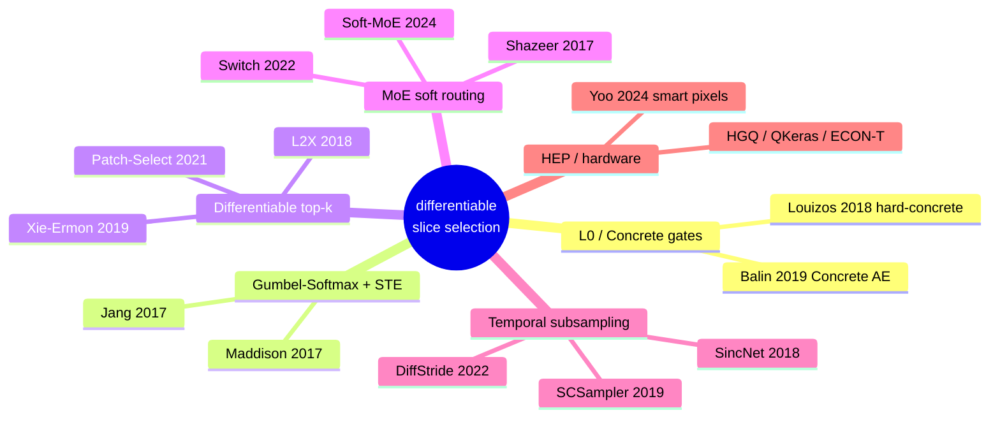

# 📚 Soft Router for Time-Slice Selection — Literature & Design Study

> Companion to [`soft_router_plan.md`](soft_router_plan.md). Produced by a **42-agent research
> workflow**: 3 agents audited the repo, 6 swept SOTA families via web search, then **every cited
> paper was adversarially verified** (28 confirmed/plausible, 1 refuted). Only verified citations appear.

---

## 1. Problem & Goal

The Smart-Pixels on-sensor classifier ingests a 16×16 charge cluster sampled over time. The full
waveform holds **101 time samples**, but the network only ever sees **2** of them: today those two
indices are the hand-picked constant `[11,26]`, baked into the TFRecords at data-generation time.
This is a hyperparameter set by human intuition, not by the data or the end-task loss.

**Goal:** replace the fixed `[11,26]` pick with a *learnable soft router* that scores all 101 slices,
is annealed from a soft convex blend toward a hard selection using the **same cosine temperature
anneal the team already trusts for SoftQuantize**, and — after training — collapses to a **small
fixed integer slice set** (2 indices). Those indices are hardwired into the ASIC readout and into
`use_time_stamps`, and the router is **discarded**. The router is strictly an *offline slice-discovery
tool*: the deployed graph is byte-identical to today's 2-slice pipeline, because the on-detector ASIC
can physically read out only a few slices and could never supply the 99 discarded ones that soft
weights would multiply.

---

## 2. How the current system works

### 2.1 SoftQuantize (the primitive to reuse)
`SoftQuantizeLayer` is a trainable 2-bit quantizer: 4 levels through 3 thresholds
(`SoftQuantizeLayer.py:31-32`). Thresholds stay ordered via softplus+cumsum
`T = T_off + cumsum(softplus(·))` (`:159-163`); levels via cumulative `expm1` deltas (`:150-157`).
A scalar sharpness `k = exp(log_k)` (`:166`) with adaptive per-threshold bandwidth `tau` (`:169-176`)
controls a sigmoid-CDF soft-argmax over the 4 bins (`_soft_quantize`, `:189-202`). The forward pass
is a **straight-through estimator**: `stop_gradient(hard − soft) + soft` (`:186`) — the net sees the
hard 2-bit value; gradients flow through the soft path. `AnnealingScheduler` reassigns `log_k` each
epoch (`AnnealingScheduler.py:42-45`) via cosine `k = k0 + (k1−k0)·½(1−cos(π·epoch/E))` (`:58-61`);
`train.py:200-208` drives `k: 1 → 67` on `soft_quantizer_output`.

### 2.2 Where `[11,26]` is decided
Slice selection is **column selection at TFRecord-build time**, before any model. Each parquet row
stores the 101×16×16 waveform flattened time-major (cols `0..25855`). `OptimizedDataGenerator_v3`
builds `arange(t·256,(t+1)·256)` per requested `t` (`v3.py:114-119`); with `use_time_stamps=[11,26]`
only 512 of 25,856 columns are read. A hard assert ties `len(use_time_stamps)==n_time` (`:108,112`).
The tensor is reshaped to `(N,2,16,16)` then transposed to `(16,16,2)` (`:610-612`).
`generate_tfrecords()` resolves indices, `time_stamps_override` winning (`prepare_tfrecords.py:38-39`);
`[11,26]` lives in caller scripts (`make_tfrs_contained_2_5_noise.py:36`). **Consequence:** the network
is structurally blind to the other 99 slices — a router needs an **all-101 training variant**.

---

## 3. SOTA survey

**3.1 Concrete / L0 stochastic gates.** Louizos, Welling, Kingma, *L0 Regularization*, ICLR 2018
([1712.01312](https://arxiv.org/abs/1712.01312)) — hard-concrete gates hitting exactly 0/1 + an
expected-L0 penalty (no fixed k). Balin, Abid, Zou, *Concrete Autoencoders*, ICML 2019
([1901.09346](https://arxiv.org/abs/1901.09346)) — temperature-annealed selector keeping exactly k
of N. *Applicability:* direct per-slice on/off gates; **zero deploy cost**. *Risk:* no hard
cardinality guarantee.

**3.2 Gumbel-Softmax + STE.** Jang, Gu, Poole, ICLR 2017
([1611.01144](https://arxiv.org/abs/1611.01144)); Maddison, Mnih, Teh, *Concrete Distribution*, ICLR
2017 ([1611.00712](https://arxiv.org/abs/1611.00712)) — the temperature-annealing recipe that morphs
a soft categorical into a hard one-hot: **exactly the soft→hard trick SoftQuantize uses.**

**3.3 Differentiable top-k (fixed cardinality).** Xie & Ermon, *Reparameterizable Subset Sampling*,
IJCAI 2019 ([1901.10517](https://arxiv.org/abs/1901.10517)); Chen et al., *L2X*, ICML 2018
([1802.07814](https://arxiv.org/abs/1802.07814)); Cordonnier et al., *Differentiable Patch Selection*,
CVPR 2021 ([2104.03059](https://arxiv.org/abs/2104.03059)). *Applicability:* strongest guarantee of
**k distinct** slices — the exact ASIC budget.

**3.4 MoE soft routing.** Shazeer et al., *Sparsely-Gated MoE*, ICLR 2017
([1701.06538](https://arxiv.org/abs/1701.06538)); Fedus/Zoph/Shazeer, *Switch*, JMLR 2022
([2101.03961](https://arxiv.org/abs/2101.03961)); Zhou et al., *Expert-Choice*, NeurIPS 2022
([2202.09368](https://arxiv.org/abs/2202.09368)); Puigcerver et al., *Soft-MoE*, ICLR 2024
([2308.00951](https://arxiv.org/abs/2308.00951)). *Caveat:* MoE routers are **per-token/per-event**,
non-deployable — ours must be **global (event-independent)**.

**3.5 Learnable temporal subsampling.** Korbar et al., *SCSampler*, ICCV 2019
([1904.04289](https://arxiv.org/abs/1904.04289)); Riad et al., *DiffStride*, ICLR 2022
([2202.01653](https://arxiv.org/abs/2202.01653)); Ravanelli & Bengio, *SincNet*, SLT 2018
([1808.00158](https://arxiv.org/abs/1808.00158)) — the "learn a few knobs, then freeze" philosophy
that matches a hardwired readout.

**3.6 HEP / hardware (integration target).** Yoo, Di Guglielmo, Fahim, Swartz et al.,
*Smart pixel sensors*, Comm. Phys. 2024 ([2310.02474](https://arxiv.org/abs/2310.02474)) — on-sensor
NN at 28nm <300µW, **explicitly flags temporal cluster development as future work** (the opening for
this router). Deploy stack: QKeras/AutoQKeras ([2006.10159](https://arxiv.org/abs/2006.10159)), HGQ
([2405.00645](https://arxiv.org/abs/2405.00645)), ECON-T ([2105.01683](https://arxiv.org/abs/2105.01683)).

> **Excluded — could not verify:** one placeholder citation (title "T", venue "?") was refuted and
> dropped. **Author-corrected during verification:** AdaFrame (Wu, Xiong, Ma, Socher, Davis).

---

## 4. Design proposals

All three feed an offline all-101 input `(16,16,101)`, insert as the first layer before the backbone,
reuse the cosine `k:1→67` anneal, and end as **two integer indices**. They differ in the selector.

### Design A — SliceGateRouter (per-slice hard-concrete / L0 gates) ⭐ recommended
- **Mechanism:** 101 logits `φₜ`. Train `sₜ=σ((log u−log(1−u)+φₜ)/β)`, stretch to `[−0.1,1.1]`, clip
  → gate `gₜ`; `x'[:,:,t]=gₜ·x[:,:,t]`. `β=1/k`. Test: deterministic `gₜ=clip(σ(φₜ)·1.2−0.1,0,1)`.
- **Loss:** `L_task + λc·(Σₜ pₜ − 2)²`; ramp λc over first half.
- **Reuse:** `log_k` + `AnnealingScheduler` (relax guard or subclass); STE; two-phase freeze.
- **Pros:** no duplicate-collapse (independent gates), native "how many slices?" knob, best-understood
  primitive. **Cons:** no hard k=2 (post-hoc top-k); biased/noisy gate gradients.

### Design B — SoftSliceRouter (annealed differentiable top-2)
- **Mechanism:** global score `s∈ℝ¹⁰¹`; relaxed top-2 by successive removal
  (`a1=softmax(k·s)`, `s'=s+log(max(1−a1,ε))`, `a2=softmax(k·s')`); soft mix → `(16,16,2)`; hard argmax
  + STE. As `k→67`, `a1,a2` → distinct one-hots.
- **Reuse:** **subclass `SoftQuantizeLayer`** → inherits `log_k`, passes the scheduler guard with zero
  edits. **Pros:** cardinality structurally = 2, tiny code. **Cons:** selectors can collapse onto one
  slice (needs `λ_div`); softmax-over-index is novel in HEP.

### Design C — k-slot soft-attention selector
- **Mechanism:** logit matrix `W∈ℝ^{k×101}`; per slot `gₛ=softmax(kₐ·Wₛ)`, soft mix; hard argmax + STE.
- **Loss:** `L_task + λ_H·Σ H(gₛ) + λ_orth·Σ⟨gₛ,gₛ'⟩` (orthogonality blocks duplicate collapse).
- **Pros:** easy to try k=3,4; fixed cardinality. **Cons:** schedule-sensitive; two-phase heavier.

---

## 5. Comparison & recommendation

| Criterion | A: L0 gates ⭐ | B: relaxed top-2 | C: k-slot attention |
|---|---|---|---|
| Cardinality guarantee | soft penalty | **structural k=2** | structural k slots |
| Duplicate-collapse risk | **none** | medium (λ_div) | medium (λ_orth) |
| "How many slices?" discovery | **native** | fixed a priori | manual k=3,4 |
| Reuse of SoftQuantize | high (relax guard) | **highest (subclass)** | **highest (subclass)** |
| New/unvalidated math | **low** | medium | medium |
| Deploy hardware cost | **zero** | **zero** | **zero** |

**Original recommendation (superseded): start with Design A** — it best matched the question
"*is 2 the right number?*" with the most-understood primitive and no collapse mode.

> **⚠️ Decision update (2026-07-02, team review):** the team set two binding constraints —
> **no additional loss term** (the SoftQuantize/ADC-proxy precedent: cardinality must be
> structural, not penalized) and **k = 2 fixed** (hard ASIC readout budget). Design A *requires*
> its cardinality penalty (free gates keep all 101 slices open, since more slices = better NLL),
> so it is out. **Design B (slot-softmax, structural k=2) is the chosen design**, with duplicate
> collapse handled architecturally via successive-removal masking (no diversity penalty either).
> See [`soft_router_plan.md`](soft_router_plan.md) for the final layer spec and workflow.

**ASIC-tied risks:** (1) discovery sees masked `(16,16,101)`, deploy sees dense `(16,16,2)` → a
**train/deploy gap** that mandates re-validating the indices in a true 2-slice retrain; (2) selection
is global/static, so the set must be **stable across noise, pileup, radiation** before it is committed;
(3) coupling the router anneal with still-moving 2-bit thresholds can lock slices prematurely →
**stagger** the anneals (float backbone during discovery); (4) all-101 TFRecords ≈ **50×** the columns.

---

## 6. Open questions
- **Is 2 the right budget?** Sweep λc / L0 to see whether 3–4 slices materially improve the NLL vs readout cost.
- **Global vs. conditional.** Is one fixed slice set optimal across all clusters, or do low-pT vs high-pT tracks prefer different slices? (Conditional routing is non-deployable, but the *answer* informs whether one set suffices.)
- **Robustness before committing.** Stability of the discovered set across noise / pileup / radiation / threshold drift.
- **Anneal coupling.** Joint (single pass, two schedulers) vs. strictly staggered (two phases)?
- **Contiguous vs. arbitrary.** Does the ASIC timing budget favor a *contiguous window* (reuse SoftQuantize's monotone softplus+cumsum for ordered window edges)?
