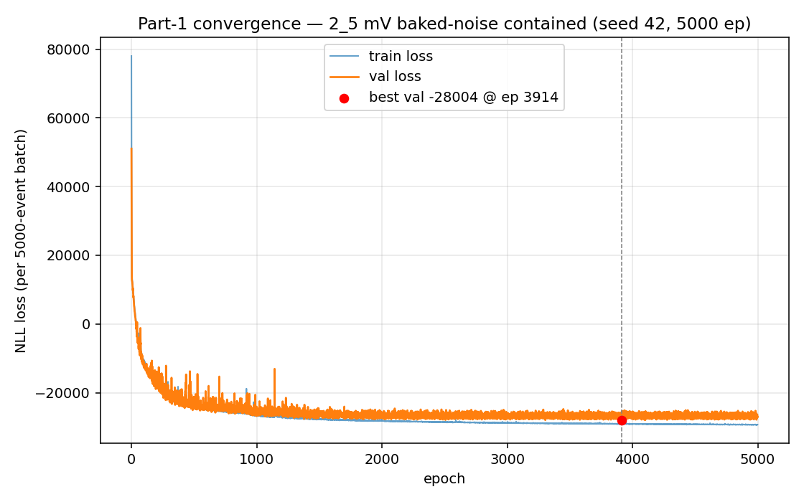
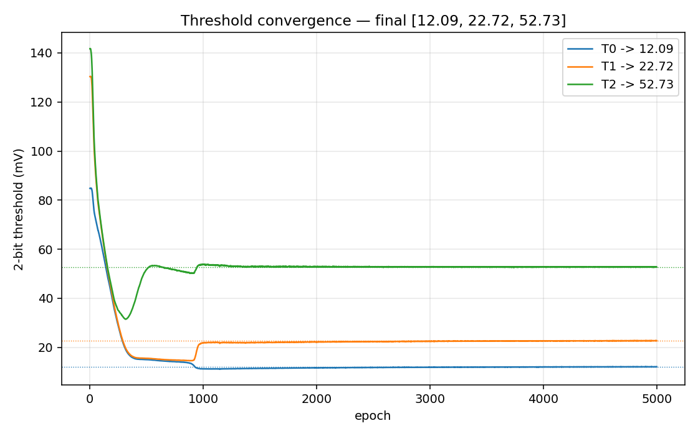
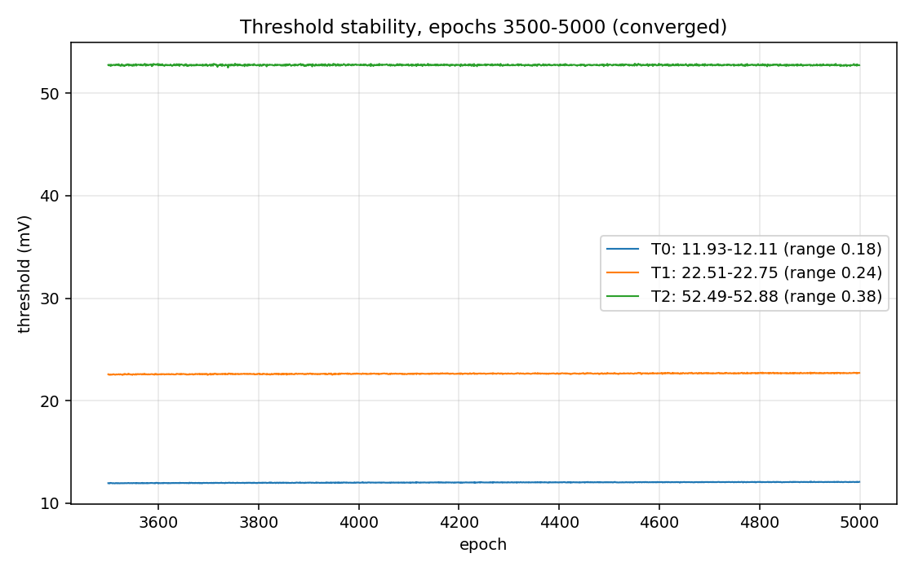

# 2-bit Threshold Optimization — 2_5 mV baked-noise contained

Part-1 (ViT_Max + SoftQuantize) · 3srb 200ps dataset · time samples [11,26]

---

## Dataset

- **mV** preamp-response dataset, σ=4.64 mV Gaussian noise (= old 80 e⁻) **baked into the TFRs**
- **Contained** clusters only: `original_atEdge == False` (≡ zero edge charge), ~47% of events
- 2 time slices = samples **[11, 26]** of the 101-sample 10 ps waveform (convolved to 200 ps)
- 80/20 train/test, batch 5000

---

## Method

- ViT_Max + SoftQuantizeLayer, offset=0, levels [0,1,2,3]
- random-init thresholds in [25,160], cosine k-anneal 1→67 over the run
- Nadam(1e-3), NLL loss, **noise=-1 at load** (already baked), **5000 epochs**, no early stopping
- single long convergence run (seed 42); reseed wrapper guards the stuck-init failure mode

---

## Result — converged thresholds

**[12.09, 22.72, 52.73]**  (levels [0,1,2,3]) · best val_loss −28,004/batch @ epoch 3914

Stable to ±0.1–0.2 over the final 1500 epochs.

---

## Threshold convergence

---

## vs clean-data thresholds

| | T0 | T1 | T2 |
|---|---|---|---|
| clean 3srb (median, no noise) | 4.15 | 13.01 | 47.24 |
| **this (σ=4.64 mV baked)** | **12.09** | **22.72** | **52.73** |

All three shifted **up** — the baked noise raises the thresholds off the noise floor for
robustness. Expected and intended.

---

## Footnote — stuck-init guard fix

This dataset's zero-likelihood ceiling is ~98,886, **just under** the old `AbortOnStuck`
threshold of 1e5 → a stuck seed once froze undetected for 379 epochs. Fixed: threshold
**1e4** + a flat-line (no-improvement-15-ep) detector + reseed loop. Seed 42 escaped first try.
